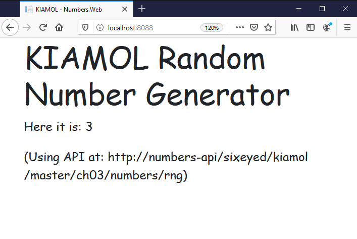

kubectl apply -f deployments.yaml

kubectl get pods

> There are two versions of the web app

[services.yaml](./solution/services.yaml) defines a ClusterIP service for the API and a LoadBalancer service for the web app. The selector for the web service uses two labels to ensure only the v2 pod is included.

```
kubectl apply -f solution/services.yaml
```

> http://localhost:8088


