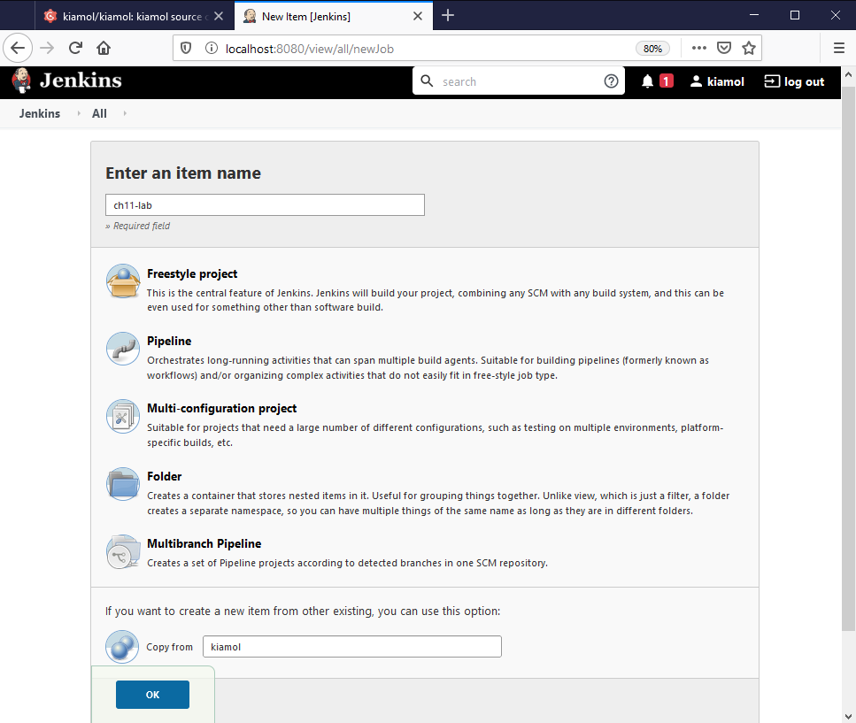
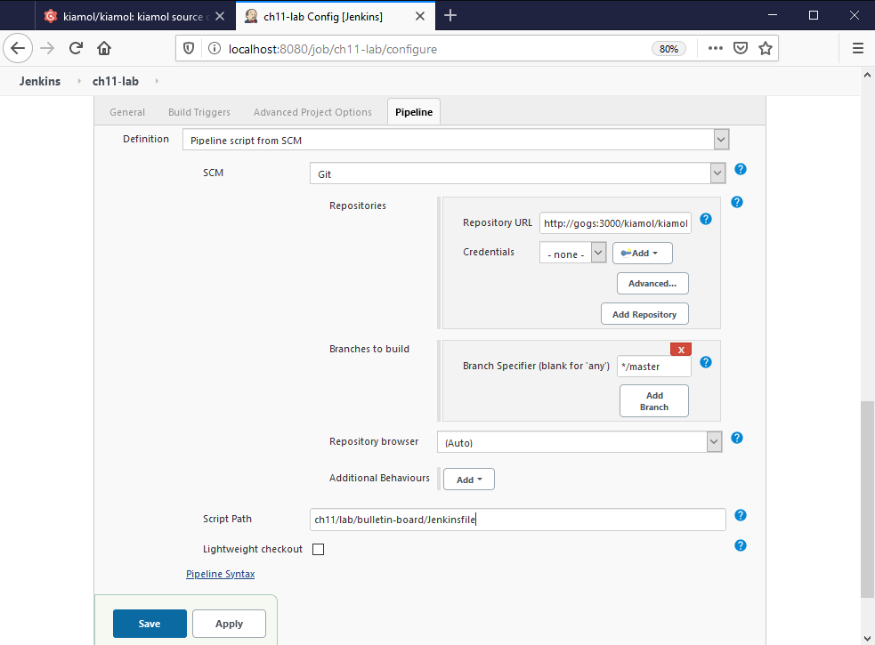

# Ch11 lab

Set up the new Jenkins job by copying the old one - from the Jenkins homepage click _New Item_ and copy the project called _kiamol_:



In the job configuration page, scroll down to the _Pipeline_ section and set the _Script Path_ to `ch11/lab/bulletin-board/Jenkinsfile`:



The project will build in a minute or so and fail - check the logs for the build stage.

## Sample Solution

Buried in the logs you'll see an error message like this:

```
#9 1.311 -----> Nodejs Buildpack version 1.6.30
#9 1.312 -----> Installing binaries
#9 1.312        engines.node (package.json): 10.6.0
#9 1.312        engines.npm (package.json): unspecified (use default)
#9 1.312        **ERROR** Unable to install node: no match found for 10.6.0 in [6.14.2 6.14.3 8.11.2 8.11.3 9.11.1 9.11.2 10.5.0 10.7.0]
#9 1.314 Failed to compile droplet: Failed to run all supply scripts: exit status 14
```

The Buildpack I'm using doesn't support the version of Node set in the application. It supports `10.5.0` and `10.7.0` but not `10.6.0` (this is an old Buildpack - later versions support more recent Node versions).

Search the source for `10.6.0` and you'll find it in this file:

- `ch11\lab\bulletin-board\src\package.json`

Update the `engines` section in that file, so it uses Node.js version `10.7.0` instead:

```
{ 
    ...
      "engines": {
    "node": "10.7.0"
  }
}
```

Now commit your changes and push to Gogs:

```
git add lab/bulletin-board/src/package.json

git commit -m 'Fix Node version'

git push gogs
```

The next build will succeed. 

> This is a bit of a tricky lab but it makes the point that the PaaS approach only supports certain app platforms and certain versions. If you have an app that doesn't fit then you can't use PaaS consistently.

## Teardown

Uninstall the Helm release, then you can remove the namespace and all the chapter resources:

```
helm uninstall bulletin-board-lab

kubectl delete ns kiamol-ch11-test

kubectl delete all -l kiamol=ch11
```