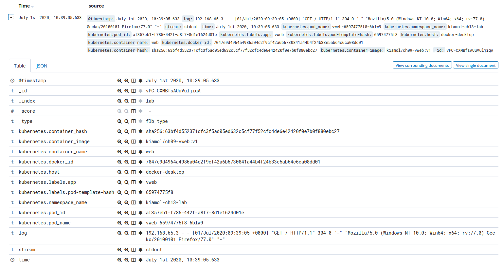
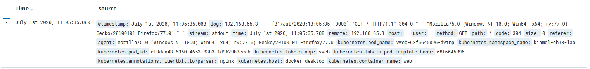
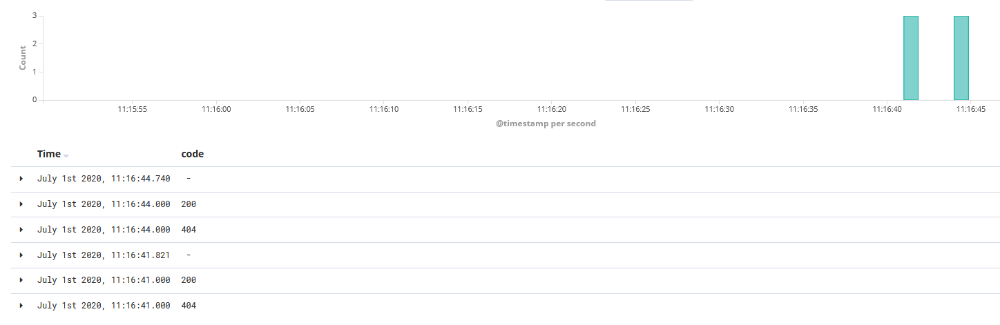

# Ch13 lab

## Setup

Deploy the logging subsystem:

```
kubectl apply -f lab/logging/
```

## Sample Solution

### Part 1

Fluent Bit is [configured](./logging/fluentbit-config.yaml) to store entries from Pods in the namespace `kiamol-ch13-lab`.

Create that namespace and deploy the vweb app:

```
kubectl create ns kiamol-ch13-lab

kubectl apply -f lab/vweb/ -n kiamol-ch13-lab
```

> Browse to the app which will trigger Nginx logs in the container.

> Browse to Kibana and create an index pattern for the index called `lab` - verify that logs are coming through.



## Part 2

The logs are there, but not parsed so they're just text.

Deploy an update to the [vweb Deployment](./solution/vweb-with-parser.yaml) which adds an annotation to use the Nginx parser:

```
kubectl apply -f lab/solution/vweb-with-parser.yaml -n kiamol-ch13-lab
```

> Browse to the app again and refresh Kibana - the logs should have fields for HTTP path, response code etc.




### Part 3

Now to filter out 304s, add a [grep filter](./solution/fluentbit-config-grep.yaml) to the Fluent Bit config and update the Pod:

```
kubectl apply -f lab/solution/fluentbit-config-grep.yaml

kubectl rollout restart ds/fluent-bit -n kiamol-ch13-lab-logging

kubectl wait --for=condition=ContainersReady pod -l app=fluent-bit -n kiamol-ch13-lab-logging

```

> Browse to the app again and refresh Kibana - no 304s are shown for recent requests



## Teardown

Remove the namespaces and that removes everything:

```
kubectl delete ns kiamol-ch13-lab

kubectl delete ns kiamol-ch13-lab-logging
```