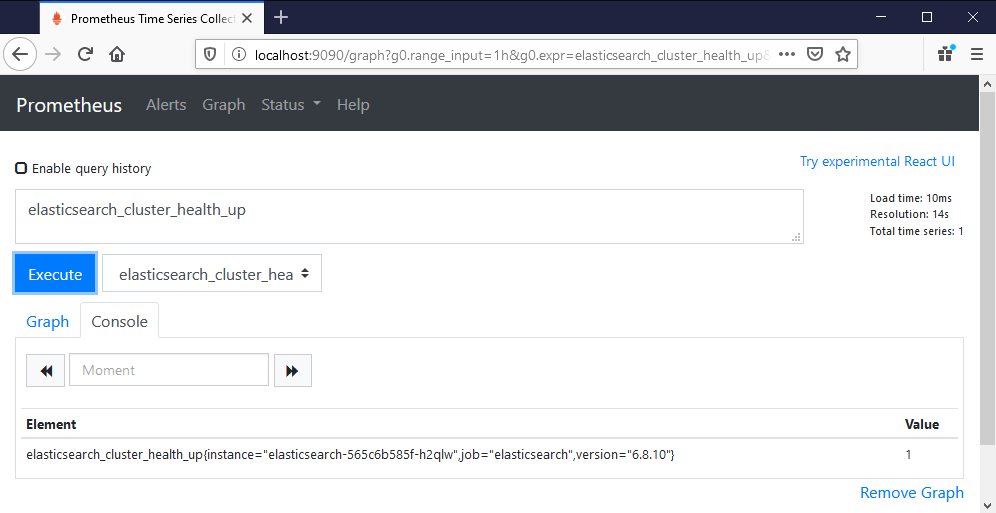

# Ch14 lab

## Setup

Deploy the monitoring subsystem:

```
kubectl apply -f lab/monitoring/
```

> Browse to the Prometheus UI - there are no targets

## Sample Solution

This is the background info:

- Prometheus is [configured](./monitoring/prometheus-config.yaml) to find targets in the namespace `kiamol-ch14-lab`

- all exporters are listed on the [Prometheus docs](https://prometheus.io/docs/instrumenting/exporters/)

- the [Elasticsearch exporter](https://github.com/justwatchcom/elasticsearch_exporter) exposes metrics on port 9114.

My solution is in [elasticsearch.yaml](./solution/elasticsearch.yaml).

Create the namespace and deploy the app:

```
kubectl create ns kiamol-ch14-lab

kubectl apply -f lab/elasticsearch.yml -n kiamol-ch14-lab
```

> Back in Prometheus you'll see the target added, with about 300 new metrics

`elasticsearch_cluster_health_up` is the most basic, it should return `1` and show the version info in the labels:



## Teardown

Remove the namespaces and that removes everything:

```
kubectl delete ns kiamol-ch14-lab

kubectl delete ns kiamol-ch14-lab-monitoring
```