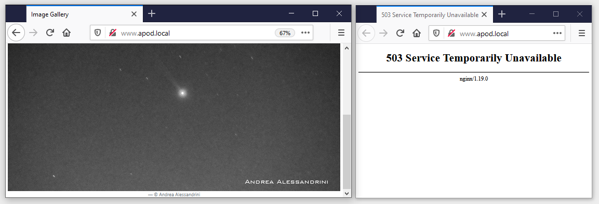

# Ch15 lab

## Setup

Deploy the ingress controller:

```
kubectl apply -f lab/ingress-nginx/
```

## Sample Solution

The background info is in the [Nginx ingress controller spec](./ingress-nginx/nginx-ingress-controller.yaml)

- it's set to monitor one namespace with the argument:  `--watch-namespace=kiamol-ch15-lab`

- it uses a custom ingress class name: `--ingress-class=nginx-lab`          

Deploy the app to the correct namespace:

```
kubectl apply -f lab/apod/ -n kiamol-ch15-lab
```

My Ingress specs for the [API](./solution/ingress-api.yaml) and the [website](./solution/ingress-web.yaml) specify the ingress class and the rate limit in annotations:

```
kubectl apply -f lab/solution/ -n kiamol-ch15-lab
```

Add the domain to your hosts file (use .sh script file on Linux/macOS):

```
./add-to-hosts.ps1 api.apod.local ingress-lab

./add-to-hosts.ps1 web.apod.local ingress-lab
```

> Browse to http://www.apod.local/ and http://api.apod.local/image and you'll get responses

> Refresh a lot and you'll get a 503 error:



## Teardown

Remove the lab namespaces:

```
kubectl delete ns -l kiamol=ch15-lab
```