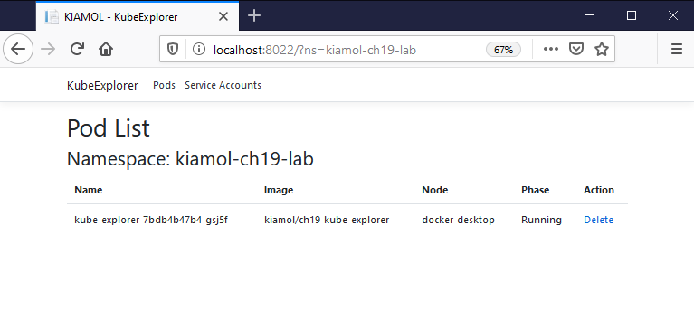
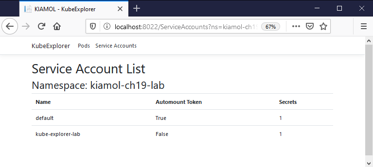

# ch17 lab

## Setup

Deploy the Kube Explorer app in the lab configuration:

```
kubectl apply -f lab/kube-explorer/
```

Note that [02-service-account.yaml](./kube-explorer/02-service-account.yaml) sets `automountServiceAccountToken` to `false` so Pods don't automatically see the token; [04-deployment.yaml](./kube-explorer/04-deployment.yaml) explicitly mounts the token in the Pod spec.

> Browse to the app and check you can access Pods - e.g. http://localhost:8022

> But not Pods in the lab namespace - http://localhost:8022?ns=kiamol-ch17-lab

## Sample Solution

To access Pods in the lab namespace [rbac-pods.yaml](./solution/rbac-pods.yaml) applies the `default-pod-reader-lab` ClusterRole to the lab namespace:

```
kubectl apply -f lab/solution/rbac-pods.yaml
```

> Now you can work with Pods in the lab namespace - http://localhost:8022?ns=kiamol-ch17-lab



> But not Service Accounts - http://localhost:8022/ServiceAccounts

To access Service Accounts [rbac-serviceaccounts.yaml](./solution/rbac-serviceaccounts.yaml) creates:

- a ClusterRole with get and list access to ServiceAccounts
- a RoleBinding applying the ClusterRole to the default namespace
- a RoleBinding applying the ClusterRole to the lab namespace

```
kubectl apply -f lab/solution/rbac-serviceaccounts.yaml
```

> Now you can access Pods in the default and lab namespaces - http://localhost:8022/ServiceAccounts?ns=kiamol-ch17-lab



## Teardown

Delete all the resources:

```
kubectl delete ns,rolebinding,role,clusterrole -l kiamol=ch17-lab
```
