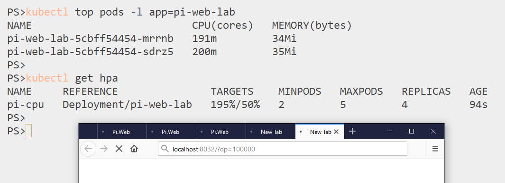

# ch19 lab

## Setup

Deploy metrics-server if you need it (check with `kubectl top nodes` - no stats means you need it):

```
kubectl apply -f metrics-server/
```

Run the app:

```
kubectl apply -f lab/pi/
```

Confirm the metrics are coming through:

```
kubectl top pods -l app=pi-web-lab
```

> Browse to the app and check the CPU spikes - e.g. http://localhost:8032/?dp=100000

## Sample Solution

You need to label your node to indicate it's in the EU region - you can use any key and value for this, but you'll need to use the same in your affinity rules:

```
kubectl label node --all kiamol.net/region=eu
```

### Pod with affinity rules 

The updated deployment in [solution/pi.yaml](./solution/pi.yaml) adds these settings:

- **node affinity** - require to run on nodes with region=eu
- **pod anti-affinity** - prefer to run on nodes without any other Pi pods
- **resources** - add memory request for the HPA to use
- **replicas** - start with 2 as that's the desired minimum

```
kubectl apply -f lab/solution/pi.yaml
```

> You'll have two Pods running; browse to the app in a few tabs and both will spike CPU

### HPA for scaling on CPU

The HPA spec in [solution/hpa-cpu.yaml](./solution/hpa-cpu.yaml) scales from 2 to 5 Pods based on target CPU utilization of 50%.

```
kubectl apply -f lab/solution/hpa-cpu.yaml
```

> Make lots of browser requests in different tabs (or adapt the `ch19/loadpi` script in) and you'll see the Pods scale up to a maximum of five replicas:




## Teardown

Delete all the resources:

```
kubectl delete all,hpa -l kiamol=ch19-lab
```

And metrics-server if you deployed it:

```
kubectl delete -f metrics-server/
```