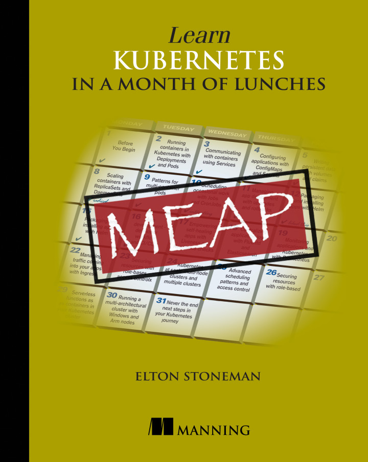

# [Learn Kubernetes in a Month of Lunches](https://www.manning.com/books/learn-kubernetes-in-a-month-of-lunches)

This is the source code for my Manning book _Learn Kubernetes in a Month of Lunches_ (codename `kiamol`).

> It's a work in progress. You can get all the completed chapters with [Manning's Early Access Program](https://www.manning.com/books/learn-kubernetes-in-a-month-of-lunches).

## Elevator Pitch

In Learn Kubernetes in a Month of Lunches you’ll go from "what’s a Pod?" to automatically scaling clusters of containers and components in just 22 hands-on lessons, each short enough to fit into a lunch break. 

Every lesson is task-focused and covers an essential skill on the road to Kubernetes mastery. You'll learn how to smooth container management with Kubernetes, including securing your clusters, and upgrades and rollbacks with zero downtime. No development stack, platform, or background is assumed. 

All patterns are described generically, so you can easily apply them to your applications and port them to other projects!

## Cover Art

